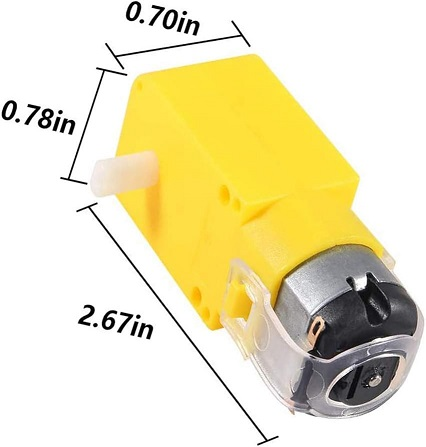

## How to print and mount the hardware components

The hardware components for this project include the Raspberry Pi, servo motor, and camera module. To set up the hardware components, follow these steps:

### Raspberry Pi

1. Connect the Raspberry Pi to a specify GPIO port
2. Use a solenoid to activate the motor
3. If is a small motor with a reduction case, you can use the 5v output from the Raspberry Pi
4. if necessary configure the GPIO port to activate the motor in the dice.py file (TODO: Move the configuration to a configuration file)

In the dice file I defined the time for the motor to be activated, you can change this value to increase or decrease the time the motor is activated.

```python
# Part of dice.py code 


def hardware_activation():
    # Pin Definitions
    pin = 6  # GPIO 6
    roll_for = 0.3

    GPIO.setmode(GPIO.BCM)  # BCM is the Broadcom SOC channel designation for GPIO numbering
    GPIO.setup(pin, GPIO.OUT)  # Set pin as an output pin
    try:
        # Turn on the GPIO pin
        GPIO.output(pin, GPIO.HIGH)
        print(f"GPIO {pin} is ON")
        time.sleep(roll_for)  # Wait for 5 seconds

        # Turn off the GPIO pin
        GPIO.output(pin, GPIO.LOW)
        print(f"GPIO {pin} is OFF")
    finally:
        GPIO.cleanup()  # Clean up GPIO settings

```

I'm using a simple and default motor with a reduction case, like this one:



DC Electric Motor 3V-6V Dual Shaft Geared TT Motor Magnetic Gearbox Engine, for Arduino Smart Car Robot

### Camera Module

I'm using an anker 2k camera with manual adjust for focus and zoom, you can use any camera usb module that you have.

