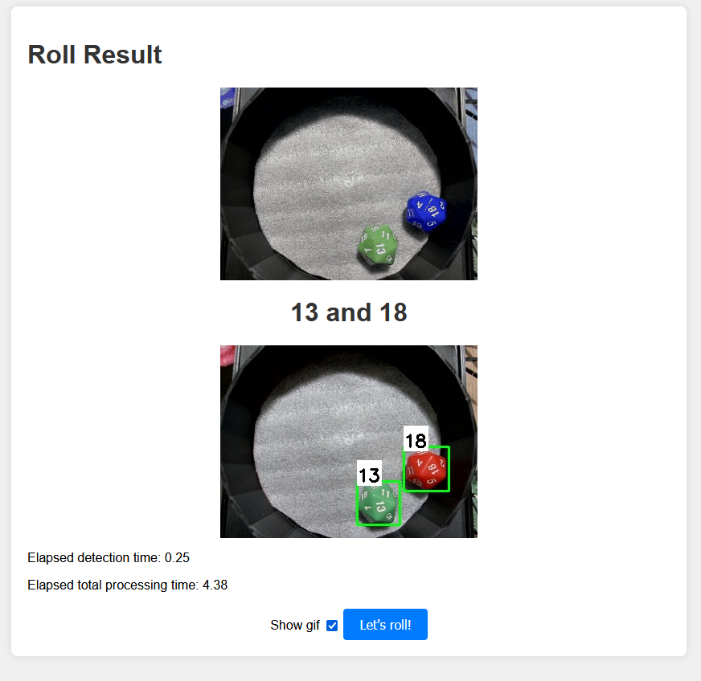
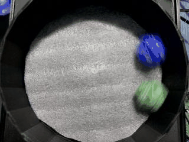
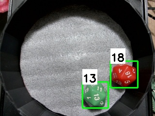

## Real-time D20 Dice Classification with Raspberry Pi using hardware integration

This project is based on the tutorial provided in the YouTube video [link](https://www.youtube.com/watch?v=XZ7FYAMCc4M), where we implement a D20 dice classification system using TensorFlow 2.0. The system integrates with a Raspberry Pi and additional hardware to physically roll a dice, capture an image, detect the dice, classify it, and return the result in real-time.







### Objective

The primary objective of this project is to demonstrate the process of training an object detection model and converting it into TensorFlow Lite format. This allows us to deploy the model on edge devices like the Raspberry Pi for real-time inference.
Key Components

TensorFlow 2 Object Detection API: Utilized to train an SSD-MobileNet or EfficientDet model with a custom dataset.
Raspberry Pi: Integrated with additional hardware to roll the dice and capture images.
Image Processing: Images captured by the Raspberry Pi are processed to detect and classify the rolled dice.
TensorFlow Lite: The trained model is converted to TensorFlow Lite format, enabling efficient deployment on edge devices.

### Usage

To replicate this project, follow these steps:

Train the model using the TensorFlow 2 Object Detection API with your custom dataset.

Use the https://github.com/EdjeElectronics/TensorFlow-Lite-Object-Detection-on-Android-and-Raspberry-Pi

Convert the trained model to TensorFlow Lite format.

https://www.youtube.com/watch?v=aimSGOAUI8Y&feature=youtu.be

Set up the Raspberry Pi and integrate additional hardware for rolling the dice and capturing images.

Just clone this repository and run the following command:

```bash
python3 --m venv venv
source venv/bin/activate
chmod +x tflite1/get_pi_requirements.sh
./tflite1/get_pi_requirements.sh
pip install -r requirements.txt
python3 main.py
``` 

All the necessary files are included in the repository, including the trained TensorFlow Lite model, label map, and Python scripts for image processing and inference on the Raspberry Pi.


## HTTP API Route

### POST /api/roll

This route is used to roll the dice and capture an image for classification. It triggers the servo motor to rotate the dice and capture an image using the camera module. The captured image is processed to detect and classify the rolled dice, and the result is returned in the response.

Response:

```json
{
  "detections": "7 and 14",
  "gif": "static/results/6f6b278b-3f94-4383-b591-0fce30f0cc65.gif",
  "image": "static/results/6f6b278b-3f94-4383-b591-0fce30f0cc65.jpg",
  "time_elapsed": 2.37,
  "time_elapsed_detection": 0.25
}
```

## API

### Object Detection

The object detection model is trained using the TensorFlow 2 Object Detection API, which provides a collection of pre-trained models and tools for training custom models. In this project, we use the SSD-MobileNet model with a custom dataset of dice images.

### TensorFlow Lite

The trained object detection model is converted to TensorFlow Lite format for deployment on edge devices like the Raspberry Pi. TensorFlow Lite is a lightweight solution for running machine learning models on resource-constrained devices, enabling real-time inference with minimal latency.

### Raspberry Pi

The Raspberry Pi is a popular single-board computer that serves as the edge device for this project. It is integrated with additional hardware, including a servo motor for rolling the dice and a camera module for capturing images. The Raspberry Pi runs the TensorFlow Lite model to detect and classify the rolled dice in real-time.

### Image Processing

Images captured by the Raspberry Pi are processed to detect and classify the dice. The image processing pipeline involves resizing, normalization, and inference using the TensorFlow Lite model. The detected dice are classified based on the trained model, and the result is displayed on the screen in real-time.

### Hardware Integration

The Raspberry Pi is connected to a servo motor and camera module for rolling the dice and capturing images. The servo motor is controlled using PWM signals to rotate the dice, while the camera module captures images of the rolled dice. The hardware components are integrated with the Raspberry Pi to enable real-time object detection and classification.

### Real-time Inference

The trained TensorFlow Lite model is deployed on the Raspberry Pi for real-time inference. The model processes images captured by the camera module to detect and classify the rolled dice. The inference results are displayed on the screen, providing real-time feedback on the dice classification.

## 3d models and STL files

The 3d model of the dice was created using Sketup and the STL file is available in the repository. The 3d model was used to create the custom dataset for training the object detection model. Unfortunatelly, the 3d model is not precise enough to store the raspberry pi and the servo motor in the box. A new version will be modeled in the future.


## Conclusion

Real-time object detection and classification on edge devices like the Raspberry Pi open up numerous possibilities for practical applications. This project serves as a demonstration of how machine learning models can be trained, converted, and deployed for real-world tasks, such as dice classification, in a resource-constrained environment.

By following the steps outlined in this project, you'll gain insights into the entire workflow of training, converting, and deploying TensorFlow Lite models on edge devices, paving the way for further exploration and experimentation in the field of edge AI.

# TODO

- [ ] Create a more precise 3d model for the dice box
- [ ] API authentication for external usage
- [ ] Captcha implementation for website usage
- [ ] Queue system for multiple requests
- [ ] Improve the 3d model to store the raspberry pi and the servo motor
- [ ] Fine tune the object detection model for better accuracy
- [ ] Implement a more robust image processing pipeline
- [ ] Add support for select a random dice in the roll in the response