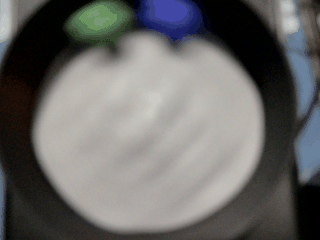

##Real-time D20 Dice Classification with Raspberry Pi

This project is based on the tutorial provided in the YouTube video [link](https://www.youtube.com/watch?v=XZ7FYAMCc4M), where we implement a D20 dice classification system using TensorFlow 2.0. The system integrates with a Raspberry Pi and additional hardware to physically roll a dice, capture an image, detect the dice, classify it, and return the result in real-time.

###Objective

The primary objective of this project is to demonstrate the process of training an object detection model and converting it into TensorFlow Lite format. This allows us to deploy the model on edge devices like the Raspberry Pi for real-time inference.
Key Components

TensorFlow 2 Object Detection API: Utilized to train an SSD-MobileNet or EfficientDet model with a custom dataset.
Raspberry Pi: Integrated with additional hardware to roll the dice and capture images.
Image Processing: Images captured by the Raspberry Pi are processed to detect and classify the rolled dice.
TensorFlow Lite: The trained model is converted to TensorFlow Lite format, enabling efficient deployment on edge devices.

# WIP

###Usage

To replicate this project, follow these steps:

Train the model using the TensorFlow 2 Object Detection API with your custom dataset.

Convert the trained model to TensorFlow Lite format.

Set up the Raspberry Pi and integrate additional hardware for rolling the dice and capturing images.

Implement image processing algorithms to detect and classify the dice in real-time.

Deploy the TensorFlow Lite model on the Raspberry Pi for inference.

##Conclusion

Real-time object detection and classification on edge devices like the Raspberry Pi open up numerous possibilities for practical applications. This project serves as a demonstration of how machine learning models can be trained, converted, and deployed for real-world tasks, such as dice classification, in a resource-constrained environment.

By following the steps outlined in this project, you'll gain insights into the entire workflow of training, converting, and deploying TensorFlow Lite models on edge devices, paving the way for further exploration and experimentation in the field of edge AI.