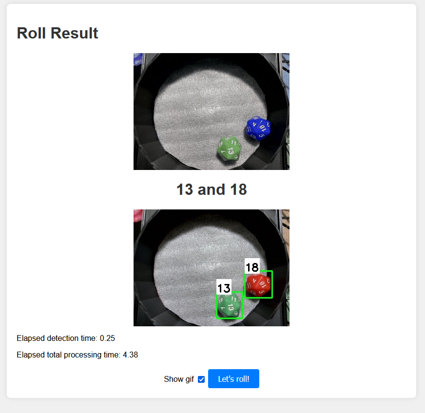
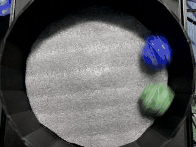
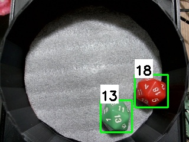

# Real-time D20 Dice Detection with Raspberry Pi

Physical D20 dice roller with real-time face detection. A servo motor rolls the dice, a USB camera captures the result, and a YOLOv8n TFLite model running on a Raspberry Pi classifies which face is showing (1–20). Results are exposed via a Flask REST API and web UI.






## Hardware

- Raspberry Pi (3B+ or 4 recommended)
- USB webcam
- Servo motor connected to GPIO pin 6
- 3D printed dice box (STL files in `3d_model/stl/`)

## Setup

**Raspberry Pi:**
```bash
python3 -m venv venv && source venv/bin/activate
chmod +x tflite1/get_pi_requirements.sh
./tflite1/get_pi_requirements.sh
pip install -r requirements-pi.txt
cp .env.example .env
./fixcam.sh  # optional: calibrate USB camera focus/exposure
python3 main.py
```

**PC (training):**
```bash
python3 -m venv venv && source venv/bin/activate
pip install -r requirements.txt
```

## API

### POST /api/roll

Triggers the servo, captures a frame, runs detection, returns the result.

```json
{
  "detections": "7 and 14",
  "image": "static/results/<uuid>.jpg",
  "gif": "static/results/<uuid>.gif",
  "time_elapsed": 2.37,
  "time_elapsed_detection": 0.25
}
```

Add `debug=true` in the form body to generate a GIF of the roll.

## Model

**YOLOv8n** trained on a custom dataset of 329 labeled D20 images (~570 annotated instances across all 20 faces), exported to INT8 TFLite for edge inference.

- ~3.2 MB model vs 11.5 MB for the original SSD-MobileNet
- ~50ms inference on Pi 4 vs ~250ms previously

### Retraining

```bash
# 1. Convert annotations (Pascal VOC XML → YOLO format)
python scripts/convert_voc_to_yolo.py

# 2. Train (~5 min on RTX 3080)
yolo train model=yolov8n.pt data=data/data.yaml epochs=150 imgsz=640 batch=16 patience=30

# 3. Export to TFLite INT8
yolo export model=runs/detect/train/weights/best.pt format=tflite imgsz=640 int8=True

# 4. Deploy
cp runs/detect/train/weights/best_saved_model/best_int8.tflite tflite1/custom_model_lite/detect.tflite
```

### Improving accuracy with new hardware

After assembling the rig with a new webcam, capture real rolls with the actual setup and fine-tune:
1. Roll the dice, confirm the result, save labeled frames to `dice_training/`
2. Re-run the training pipeline above
3. Replace `detect.tflite`

## 3D Models

STL files for the dice box and mechanical parts are in `3d_model/stl/`. The current model does not fit the Raspberry Pi and servo motor — a revised version is planned.

## TODO

- [ ] Improve 3D model to house the Raspberry Pi and servo motor
- [ ] Add data collection mode to Flask app (roll → confirm label → auto-save for retraining)
- [ ] Improve motion detection robustness (background subtraction)
- [ ] API authentication for external usage
- [ ] Queue system for concurrent requests
